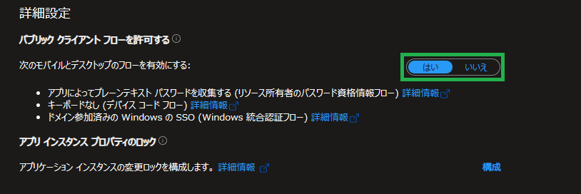

# azure-entra-jwt-script

Azure Entra ID を認証するための JWT(JSON Web Token) を生成するスクリプトです。

## 使い方

### 1. 依存パッケージのインストール

```bash
$ pip install -r requirements.txt
```

### 2. 環境変数の設定

`.env.sample`をコピーして`.env`を作成し、Azure Entra ID のアプリケーションIDとシークレットを設定します。

```bash
$ cp .env.sample .env
$ vi .env
```

### 3. アプリのパブリック クライアント フローを許可

スクリプトからの認証を行うために、Azure Entra ID のアプリケーションのパブリック クライアント フローを許可する必要があります。

具体的には以下の手順で設定を行います。

1. Azure Entra ID のアプリケーションのページを開く
2. 「認証」をクリック
3. 「パブリック クライアント フローを許可する」を「はい」に設定



### 4. JWT の生成

以下のコマンドを実行することでターミナルに JWT が表示されます。
```bash
$ python generate_jwt.py
```

### 5. JWT の検証

JWT の検証は[JWT.io](https://jwt.io/)で行うことができます。
